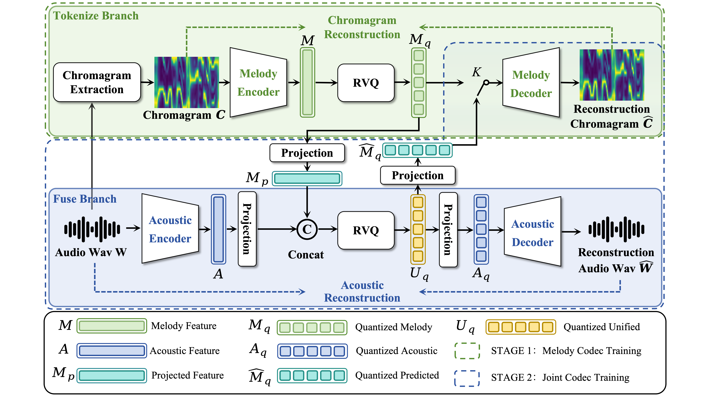

# MeloCodec

<p align="center">
  <a href="https://piedpiperg.github.io/MeloCodec/">
    
  </a>
  <a href="https://github.com/piedpiperG/MeloCodec/tree/main/melocodec">
    
  </a>
</p>

MeloCodec is a neural audio codec for singing voice representation. It uses
discrete melodic priors to improve pitch consistency and low-bitrate
reconstruction quality.

<p align="center">
  
</p>

In the code implementation, the architecture is named **BWC**, short for
**Bandwidth-efficient With Chroma**. `MeloCodec` is provided as an alias so the
paper name and code name both work:

```python
from melocodec import BWC, MeloCodec

assert MeloCodec is BWC
```

## Project Page

The static project page lives in `docs/` and is deployed by the GitHub Pages
workflow in `.github/workflows/pages.yml`.

After the workflow runs on `main`, the page will be available at:

```text
https://piedpiperg.github.io/MeloCodec/
```

Local preview:

```bash
cd docs
python -m http.server 8088
```

Then open `http://localhost:8088/`.

## Code Layout

- `melocodec/bwc.py`: BWC / MeloCodec tokenize-then-fuse architecture.
- `melocodec/chroma.py`: ChromaCodec melody tokenizer.
- `melocodec/quantize.py`: residual vector quantization modules.
- `melocodec/layers.py`: DAC-style encoder, decoder, residual blocks, and Snake activation.
- `examples/minimal_forward.py`: small random-input forward example.
- `tests/test_architecture.py`: smoke test for the public architecture.

This release intentionally excludes internal training data paths, checkpoints,
large experiment logs, private evaluation pipelines, and the pitch-shifting
implementation.

## Quick Start

```bash
pip install -e .
python examples/minimal_forward.py
```

The example constructs a small BWC model, runs one waveform through the
architecture, and prints reconstructed audio and code tensor shapes.

## Minimal Fusion Sketch

The core idea of BWC / MeloCodec is intentionally simple: learn a discrete
melody tokenizer first, freeze the stable melody encoder and codebook, then
fuse the quantized melody prior with the acoustic codec latent before the final
RVQ.

```python
import torch
from torch import nn


class BWC(nn.Module):
    def __init__(
        self,
        acoustic_encoder: nn.Module,
        acoustic_decoder: nn.Module,
        melody_codec: nn.Module,
        fusion_quantizer: nn.Module,
        acoustic_dim: int,
        melody_dim: int,
    ):
        super().__init__()
        self.acoustic_encoder = acoustic_encoder
        self.acoustic_decoder = acoustic_decoder

        # Melody codec is pretrained on chromagram reconstruction.
        self.melody_codec = melody_codec
        for param in self.melody_codec.encoder.parameters():
            param.requires_grad = False
        for param in self.melody_codec.quantizer.parameters():
            param.requires_grad = False

        self.melody_to_fusion = nn.Conv1d(melody_dim, melody_dim, kernel_size=1)
        self.fuse = nn.Conv1d(acoustic_dim + melody_dim, acoustic_dim + melody_dim, kernel_size=1)
        self.fusion_quantizer = fusion_quantizer

        self.to_acoustic = nn.Conv1d(acoustic_dim + melody_dim, acoustic_dim, kernel_size=1)
        self.to_melody = nn.Conv1d(acoustic_dim + melody_dim, melody_dim, kernel_size=1)

    def encode(self, wav: torch.Tensor, n_quantizers: int | None = None):
        acoustic_latent = self.acoustic_encoder(wav)

        # Tokenize-then-fuse: use quantized melody features, not raw chroma features.
        with torch.no_grad():
            melody = self.melody_codec.encode(wav, return_chroma=True)
            melody_latent = melody["z_q"]
            melody_tokens = melody["tokens"]

        melody_latent = self.melody_to_fusion(melody_latent)
        melody_latent = torch.nn.functional.interpolate(
            melody_latent,
            size=acoustic_latent.shape[-1],
            mode="linear",
            align_corners=False,
        )

        fused = torch.cat([acoustic_latent, melody_latent], dim=1)
        fused = self.fuse(fused)
        fused_quantized, codes, latents, commitment_loss, codebook_loss = self.fusion_quantizer(
            fused,
            n_quantizers=n_quantizers,
        )

        return {
            "z_q": fused_quantized,
            "codes": codes,
            "latents": latents,
            "melody_tokens": melody_tokens,
            "commitment_loss": commitment_loss,
            "codebook_loss": codebook_loss,
        }

    def decode(self, z_q: torch.Tensor):
        acoustic_latent = self.to_acoustic(z_q)
        predicted_melody_latent = self.to_melody(z_q)

        wav_hat = self.acoustic_decoder(acoustic_latent)
        chroma_hat = self.melody_codec.decode(predicted_melody_latent)
        return wav_hat, chroma_hat

    def forward(self, wav: torch.Tensor):
        encoded = self.encode(wav)
        wav_hat, chroma_hat = self.decode(encoded["z_q"])
        return {
            "audio": wav_hat,
            "chroma_recon": chroma_hat,
            "codes": encoded["codes"],
            "vq_commitment_loss": encoded["commitment_loss"],
            "vq_codebook_loss": encoded["codebook_loss"],
        }

MeloCodec = BWC
```

In Stage 1, `melody_codec` learns to reconstruct chromagrams through a discrete
bottleneck. In Stage 2, BWC freezes the melody encoder and melody quantizer,
fuses their quantized output with the acoustic latent, and trains the unified
codec with waveform, spectral, adversarial, VQ, and chroma reconstruction
losses.
